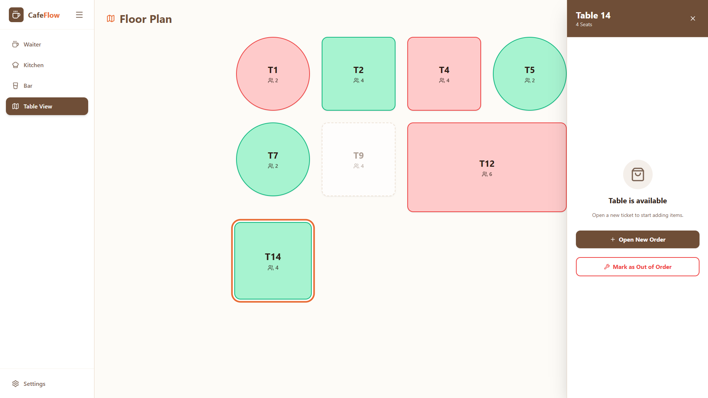
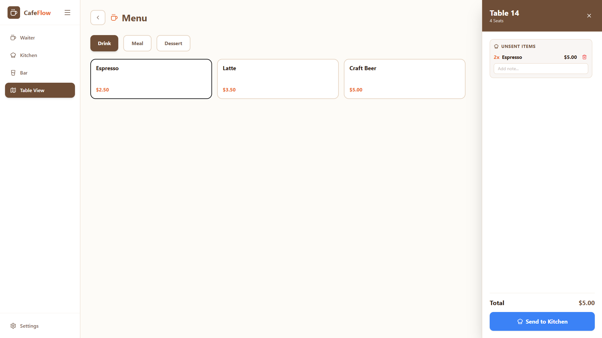
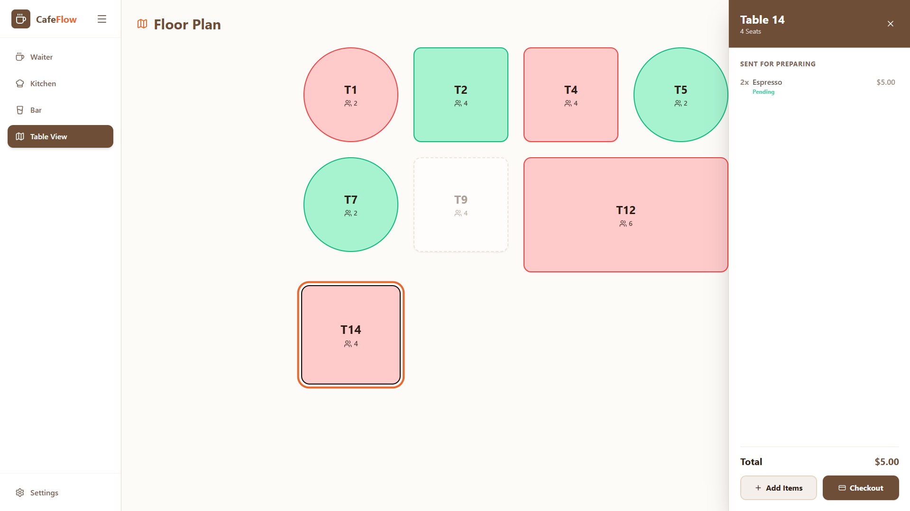
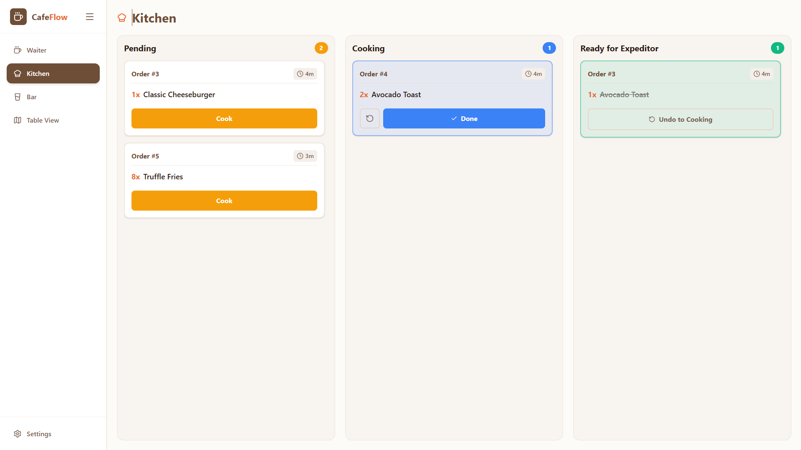
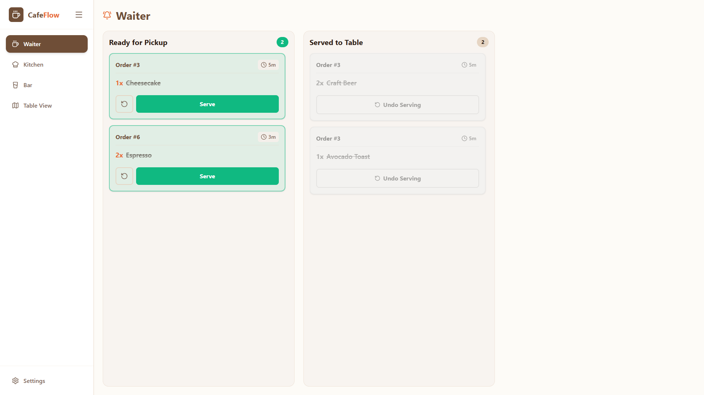
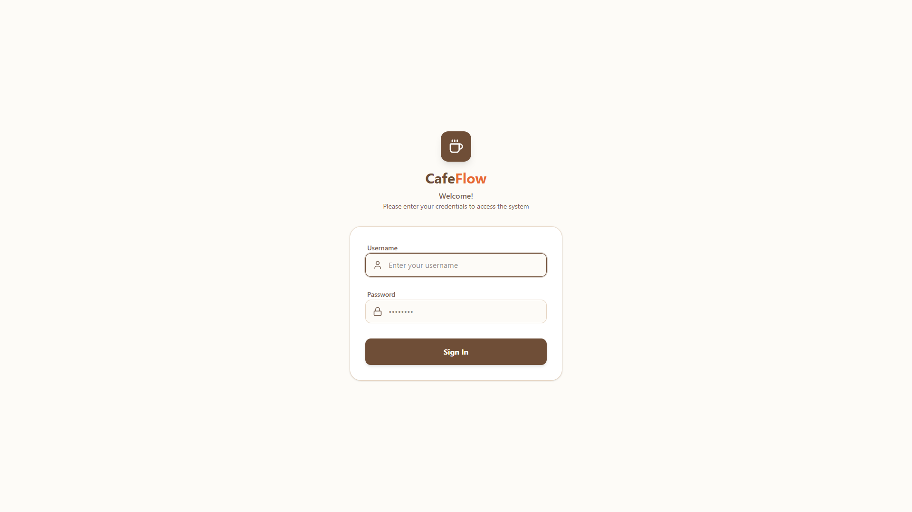
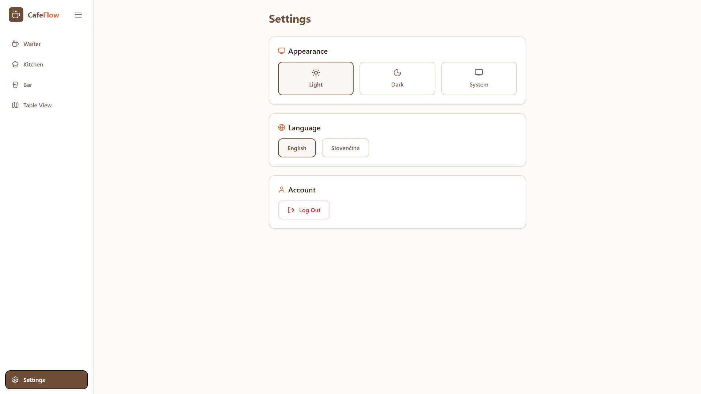
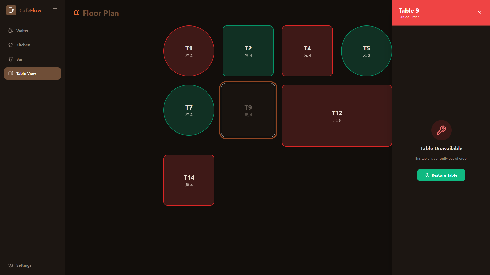
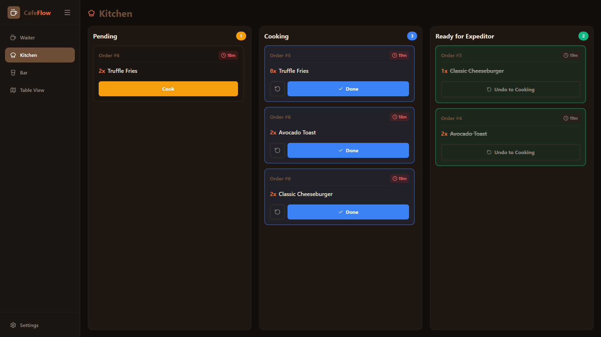

# Cafe POS & Management System

A real-time, full-stack Point of Sale (POS) and table management system designed for fast-paced cafe environments.

This project demonstrates a clean architecture featuring an interactive floor plan, real-time order routing to the kitchen/bar via WebSockets, stateless JWT security, and a fully containerized deployment pipeline.

---

## Tech Stack

### Frontend (Client)

- **Language:** TypeScript
- **Framework:** React + Vite
- **Routing & HTTP:** React Router, Axios
- **Styling:** Tailwind CSS
- **Internationalization (i18n):** `react-i18next`
- **Real-Time:** `@stomp/stompjs` & `sockjs-client`
- **State Management:** Custom React Hooks & Context
- **Icons:** Lucide React

### Backend (API & Messaging)

- **Language:** Java 21
- **Framework:** Spring Boot 4.0
- **Database:** PostgreSQL 15 + Spring Data JPA (Hibernate)
- **Security:** Spring Security + Stateless JWT
- **Real-Time:** Spring WebSocket Message Broker (STOMP)
- **Mapping & Utilities:** MapStruct, Lombok, Spring Validation
- **Testing:** JUnit Jupiter, Mockito, Testcontainers (PostgreSQL integration testing)

### Infrastructure & DevOps

- **Containerization:** Docker & Docker Compose
- **CI/CD:** GitHub Actions

---

## Key Features

### Interactive UI

- Dynamic, data-driven table layout adapting shapes and sizes based on seating capacity.
- Real-time visual feedback: Tables instantly change color based on occupancy (Available, Occupied, Out of Order).
- Strict UI safeguards preventing staff from seating guests at broken or unavailable tables.

Demo screenshots can be found at the bottom of this README

### Theming & Localization

- **Theme Toggling:** CSS architecture allowing seamless switching between Light and Dark modes.
- **Multi-Language Support (i18n):** Built-in localization using `i18next`, dynamically adapting the POS interface to the staff member's preferred language.

### Real-Time Order Routing (WebSockets)

- Eliminates manual page refreshes.
- Orders sent from the floor plan are instantly pushed to the `KITCHEN_TOPIC` or `BAR_TOPIC` via STOMP WebSockets.
- Connection is securely gated behind JWT validation.

### Secure Authentication Flow

- Custom Spring Security filter chain ensuring all REST and WebSocket endpoints are protected.
- React Router configuration enforcing authenticated route protection and token lifecycle management.

### Architecture

- **Clean Backend:** Strict separation of concerns: dumb Controllers, pure Business Logic Services, robust entity mapping via MapStruct, simple and readable code.
- **Resilient Frontend:** Avoids "stale closure" traps, handles unexpected edge cases, and uses semantic CSS variables for perfect light/dark mode transitions.

---

## Local Development Setup

### 1. Prerequisites

- Docker & Docker Compose installed.
- Git.

### 2. Environment Variables

Before running the project, create a `.env` file in the root directory (or inside the backend folder, depending on your setup) and provide the following variables:

```env
# Database Configuration
POSTGRES_USER=postgres
POSTGRES_PASSWORD=postgres
POSTGRES_DB=cafe_db

# Security
JWT_SECRET=your_super_secret_256_bit_string_here
JWT_EXPIRATION_MS=86400000

# Frontend
VITE_WS_URL=http://localhost:8080/ws-cafe
```

### 3. One-Click Start (Docker)

The entire application (Postgres Database, Spring Boot Backend, and Nginx-served React Frontend) is orchestrated via Docker Compose.

```Bash
# Clone the repository
git clone <https://github.com/floatyserve/cafe-app>
cd cafe-app

# Build and start all containers
docker-compose up --build -d
```

Once the containers are running:

Frontend App: http://localhost

Backend API: http://localhost:8080

### 4. Running Without Docker (Manual Setup)

If you prefer to run the services directly on your host machine for debugging:

Start a local PostgreSQL instance on port 5433.

Navigate to /backend and run mvn spring-boot:run.

Navigate to /frontend, run npm install, then npm run dev.

## Continuous Integration (GitHub Actions)

This repository enforces code quality via an automated CI pipeline. On every push to the main branch, a GitHub Action runner:

Spins up a temporary PostgreSQL service container.

Checks out the code and sets up Java 21.

Compiles the application and executes the full Mockito & MockMvc test suite.

Blocks merging if any business logic or HTTP routing is broken.

```

```

# Some screenshots of the app

As a result of the majority of normal human beings using dark theme at the GitHub, I provided the images in light mode for better contrast :D

### Table View (Floor Plan)



### Table View (Opening Order)



### Table View (Opened Order)



### Kitchen Page (Real-Time Orders)



### Waiter Page



### Login Page



### Settings Page



Fine, i will show some nice colors too...

### Dark Mode




